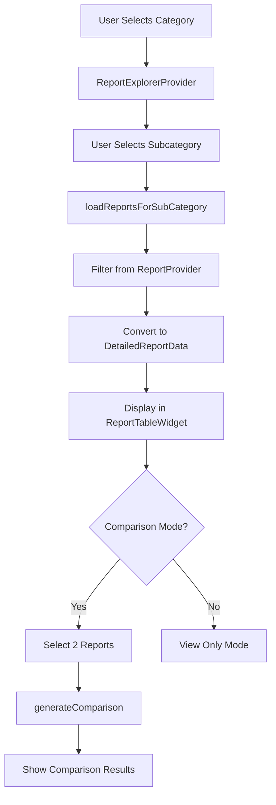

# 📊 Report Explorer Feature - Complete Implementation Guide

## 🎯 Overview

The **Report Explorer** feature allows users to filter, view, and compare medical reports in a spreadsheet-style format. This feature is now fully integrated into your MedTrack application's home screen.

---

## 📁 File Structure

```
lib/
├── features/
│   ├── reports/
│   │   ├── models/
│   │   │   └── report_category_model.dart       # Enums & data models
│   │   └── providers/
│   │       └── report_explorer_provider.dart    # State management
│   └── home/
│       └── widgets/
│           └── report_explorer/
│               ├── category_button.dart          # Category selection button
│               ├── sub_category_expansion.dart   # Subcategory list item
│               ├── report_table_widget.dart      # Spreadsheet-style table
│               ├── comparison_controller.dart     # Comparison UI controls
│               └── report_explorer_section.dart   # Main widget
└── main.dart                                     # Provider registration
```

---

## 🎨 Feature Components

### 1. **Data Models** (`report_category_model.dart`)

#### Enums:
- `ReportCategory` - Lab or Imaging
- `LabSubCategory` - 11 lab test categories (CBC, Blood Sugar, Lipid Profile, etc.)
- `ImagingSubCategory` - 8 imaging types (X-Ray, CT Scan, MRI, etc.)
- `ComparisonStatus` - Improved, Worsened, Increased, Decreased, Stable, NoData

#### Models:
- `DetailedReportData` - Structured report with parameters
- `ParameterValue` - Individual test parameter with value, unit, and normal range
- `ComparisonResult` - Comparison between two report parameters

---

### 2. **State Management** (`report_explorer_provider.dart`)

#### Key Methods:

| Method | Purpose |
|--------|---------|
| `selectCategory()` | Toggle category selection (Lab/Imaging) |
| `selectSubCategory()` | Select specific test type |
| `loadReportsForSubCategory()` | Filter and load relevant reports |
| `toggleComparisonMode()` | Enable/disable comparison mode |
| `toggleReportSelection()` | Select reports for comparison (max 2) |
| `generateComparison()` | Compare two reports parameter by parameter |

#### Comparison Logic:
- **Improved**: Parameter moved closer to normal range
- **Worsened**: Parameter moved away from normal range
- **Increased/Decreased**: Simple numeric change (>5%)
- **Stable**: Change less than 5%

---

### 3. **UI Components**

#### CategoryButton
```dart
// Expandable button for Lab/Imaging categories
CategoryButton(
  category: ReportCategory.lab,
  isSelected: true,
  onTap: () { /* ... */ },
)
```

**Features:**
- Animated selection state
- Gradient background when selected
- Icon + descriptive text
- Smooth expand/collapse

---

#### SubCategoryExpansion
```dart
// List item for test subcategories
SubCategoryExpansion(
  subCategory: LabSubCategory.cbc,
  isSelected: false,
  onTap: () { /* ... */ },
)
```

**Features:**
- Icon matching test type
- Hover effects
- Selection indicator
- Smooth transitions

---

#### ReportTableWidget
```dart
// Excel-style data table
ReportTableWidget(
  reports: reportList,
  isComparisonMode: true,
  selectedReportIds: ['id1', 'id2'],
  onReportToggle: (id) { /* ... */ },
  comparisonResults: results,
)
```

**Features:**
- ✅ Fixed first column (parameters)
- ✅ Horizontal scroll for multiple reports
- ✅ Vertical scroll for long parameter lists
- ✅ Checkbox selection in comparison mode
- ✅ Color-coded values (High/Low/Normal)
- ✅ Comparison column with status icons
- ✅ Summary/Notes row at bottom

---

#### ComparisonController
```dart
// Control panel for comparison feature
ComparisonController(
  isComparisonMode: true,
  selectedCount: 2,
  canGenerate: true,
  onToggleComparisonMode: () { /* ... */ },
  onGenerateComparison: () { /* ... */ },
)
```

**Features:**
- Status messages guide user
- Start/Cancel comparison mode
- Generate comparison button (enabled when 2 reports selected)
- Color-coded status indicators

---

## 🚀 Usage Guide

### For Users:

1. **Navigate to Home Screen** → Scroll down past Recent Reports
2. **Select Category**: Tap "Lab Reports" or "Imaging Reports"
3. **Choose Test Type**: Select from expanded subcategory list
4. **View Reports**: See all reports in spreadsheet format
5. **Compare Reports** (optional):
   - Tap "Start Comparing"
   - Check 2 report dates
   - Tap "Generate"
   - View comparison column with change indicators

---

### For Developers:

#### Adding New Subcategories:

**Step 1: Add to enum** (report_category_model.dart)
```dart
enum LabSubCategory {
  cbc,
  bloodSugar,
  myNewTest,  // Add here
}
```

**Step 2: Update extension**
```dart
extension LabSubCategoryExtension on LabSubCategory {
  String get displayName {
    switch (this) {
      case LabSubCategory.myNewTest:
        return 'My New Test';
      // ...
    }
  }

  List<String> get defaultParameters {
    switch (this) {
      case LabSubCategory.myNewTest:
        return ['Param1', 'Param2', 'Param3'];
      // ...
    }
  }
}
```

**Step 3: Update matching logic** (report_explorer_provider.dart)
```dart
bool _isTestTypeMatch(String testType, dynamic subCategory) {
  // ...
  case LabSubCategory.myNewTest:
    return testTypeLower.contains('mynewtest');
}
```

---

#### Customizing UI Colors:

All colors reference `AppColors` from your theme:
```dart
// app_colors.dart
AppColors.primary       // Primary brand color
AppColors.secondary     // Secondary accent
AppColors.background    // Light backgrounds
AppColors.textPrimary   // Main text
AppColors.textSecondary // Subtle text
```

---

## 🎭 UI Behavior

### Animations:
- **Category Selection**: 300ms ease-in-out
- **Subcategory Expansion**: 250ms smooth
- **Comparison Mode Toggle**: Instant with visual feedback
- **Table Scrolling**: Native smooth scrolling

### Responsive Design:
- Works on mobile (phone/tablet)
- Horizontal scroll for many reports
- Touch-friendly tap targets (min 48px)
- Sticky parameter column

### Empty States:
- No reports: Shows icon + message + "Upload Report" CTA
- Loading: Animated spinner with text

---

## 🧪 Testing Scenarios

### 1. Basic Flow
```
1. Open app → Login
2. Navigate to Home
3. Scroll to "Report Explorer"
4. Tap "Lab Reports"
5. Tap "Complete Blood Count (CBC)"
6. View table with CBC reports
```

### 2. Comparison Flow
```
1. Select subcategory with 2+ reports
2. Tap "Start Comparing"
3. Check 2 different dates
4. Tap "Generate"
5. View comparison column with changes
6. Verify icons/colors match status
```

### 3. Edge Cases
```
- No reports uploaded yet
- Only 1 report (comparison disabled)
- Missing parameter data
- Non-numeric values
- Extremely long parameter names
- Many reports (50+) - scroll performance
```

---

## 🔧 Configuration

### Default Parameters per Test Type:

| Test Type | Parameters Count | Examples |
|-----------|------------------|----------|
| CBC | 8 | Hemoglobin, RBC, WBC, Platelets |
| Blood Sugar | 4 | Fasting, Post Prandial, HbA1c |
| Lipid Profile | 6 | Cholesterol, HDL, LDL, Triglycerides |
| Thyroid | 5 | TSH, T3, T4, Free T3, Free T4 |

### Comparison Thresholds:
- **Stable**: < 5% change
- **Significant**: > 5% change
- **Normal Range**: Uses `normalMin` and `normalMax` from database

---

## 📊 Data Flow



---

## 🎯 Key Features Implemented

✅ **Category Filtering**: Lab vs Imaging
✅ **11 Lab Subcategories**: CBC, Blood Sugar, Lipid, Liver, Kidney, Thyroid, Urine, Electrolytes, Vitamins, Hormones, Infection Markers
✅ **8 Imaging Subcategories**: X-Ray, CT, MRI, Ultrasound, PET, Mammogram, ECG/Echo, Endoscopy
✅ **Spreadsheet-Style Table**: Fixed parameters column + scrollable date columns
✅ **Comparison Logic**: Smart algorithm considers normal ranges
✅ **Visual Indicators**: Icons and colors for improvement/worsening
✅ **State Management**: Provider pattern with ChangeNotifier
✅ **Reusable Components**: All widgets are modular and reusable
✅ **Smooth Animations**: 250-300ms transitions
✅ **Responsive**: Works on all screen sizes
✅ **Empty States**: Helpful messages when no data

---

## 🐛 Troubleshooting

### Issue: "No reports showing in table"
**Solutions:**
1. Check if reports exist in database
2. Verify `testType` or `testName` matches subcategory
3. Check `_isTestTypeMatch()` logic includes your test name
4. Ensure reports are fetched (`reportProvider.fetchReports()`)

### Issue: "Comparison not working"
**Solutions:**
1. Verify exactly 2 reports are selected
2. Check that reports have `testResults` or `parameters`
3. Ensure data is numeric for proper comparison
4. Look for console errors in `generateComparison()`

### Issue: "Colors not displaying correctly"
**Solutions:**
1. Check `AppColors` is properly imported
2. Verify theme is applied in `MaterialApp`
3. Use `Theme.of(context)` for dynamic colors

---

## 📱 Screenshots Description

### Home Screen - Report Explorer Section
- Located below "Recent Reports"
- Shows 2 category buttons (Lab, Imaging)
- Clean medical theme with gradients

### Expanded Category
- Subcategory list with icons
- Selected item highlighted in primary color
- Smooth slide-down animation

### Report Table
- Fixed parameter column on left
- Date columns horizontally scrollable
- Color-coded cells (red/orange/green)
- Summary row at bottom

### Comparison Mode
- Checkboxes appear above date columns
- Selection limit indicator (max 2)
- Generate button enabled when ready
- Comparison column shows icons + descriptions

---

## 🔮 Future Enhancements (Optional)

- **Export to PDF**: Print/share table view
- **Graphical Trends**: Line charts for parameters over time
- **AI Insights**: "Your cholesterol improved by 15%"
- **Filters**: Date range, doctor, lab name
- **Search**: Find specific parameters
- **Favorites**: Pin frequently viewed tests
- **Notifications**: Alert when new report in category

---

## 📞 Support

For questions or issues:
1. Check error logs in VS Code Debug Console
2. Use `print()` statements in provider methods
3. Verify data structure matches models
4. Test with sample data first

---

## 🎉 Success!

Your Report Explorer feature is now **fully implemented and integrated**! 

**Next Steps:**
1. Run the app: `flutter run`
2. Test the feature with existing reports
3. Upload more reports to test comparison
4. Customize colors/icons as needed

**Happy Coding! 🚀**
